# [Mandelbrot]

_Warning: this project is not production ready, API might change without notice._

**Mandelbrot** is a [Next.js](https://nextjs.org) and [MDX](https://mdxjs.com) powered, no-code site generator.

**quadratic_mandelbrot.py**
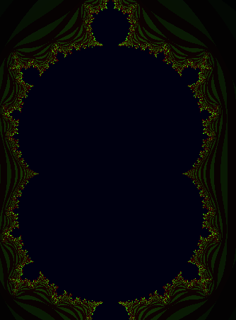

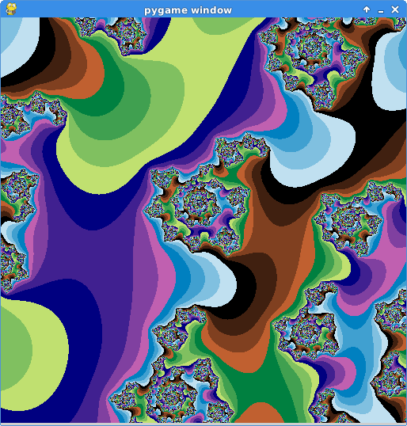
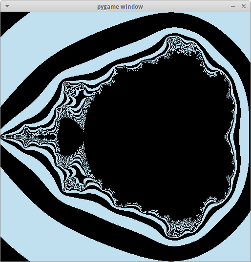
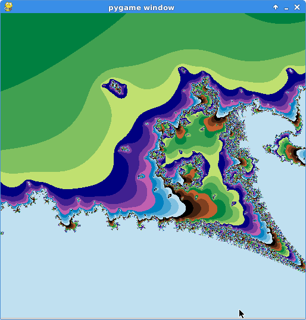
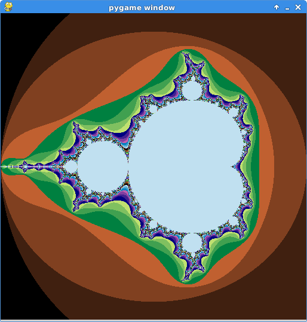
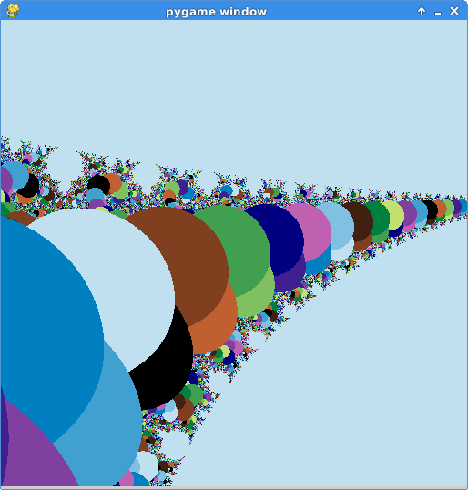
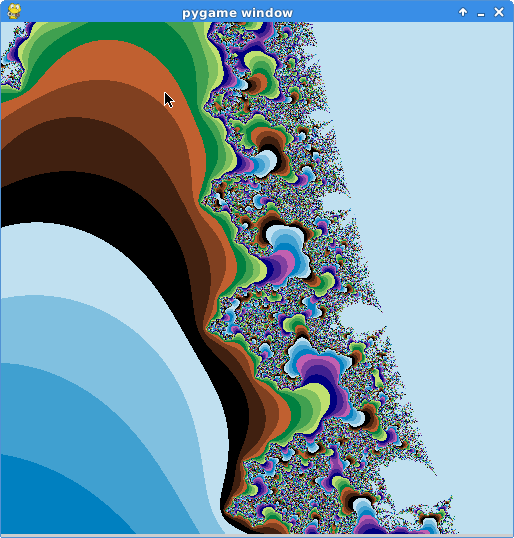
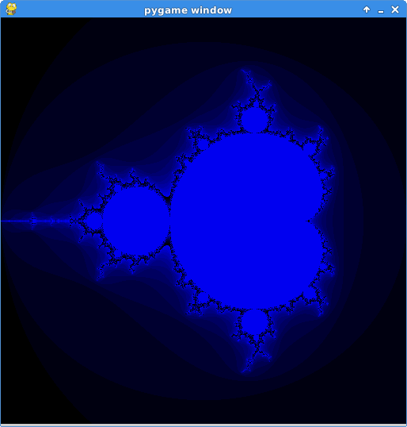
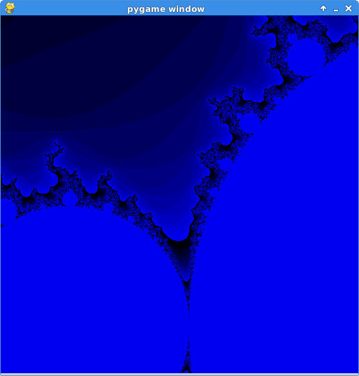
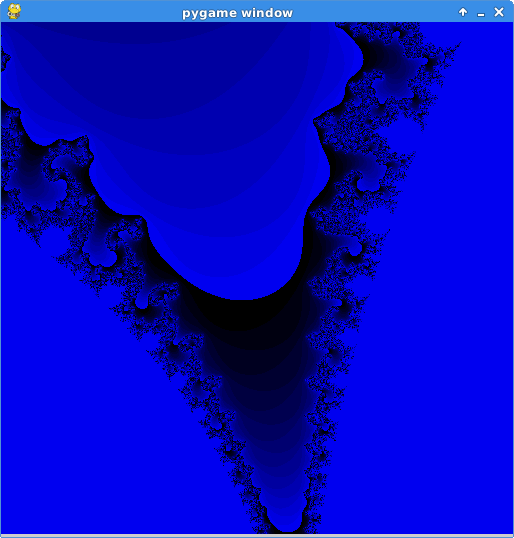
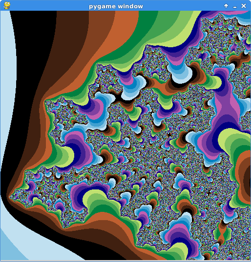
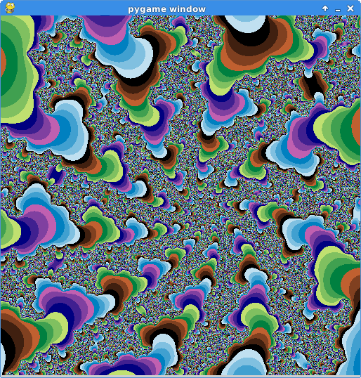
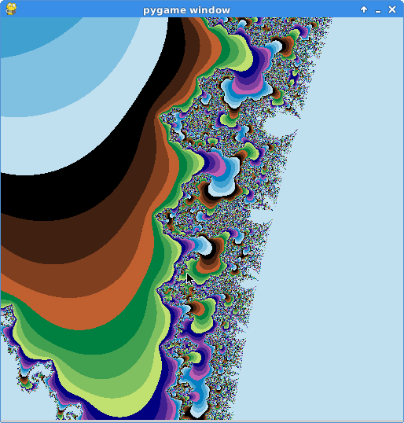
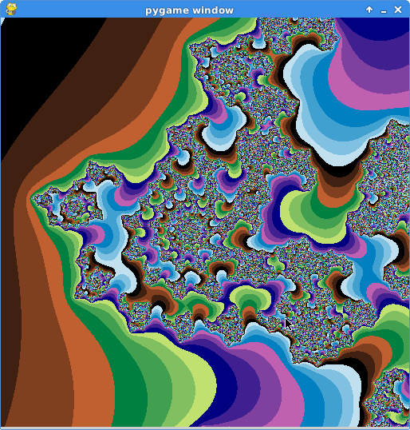
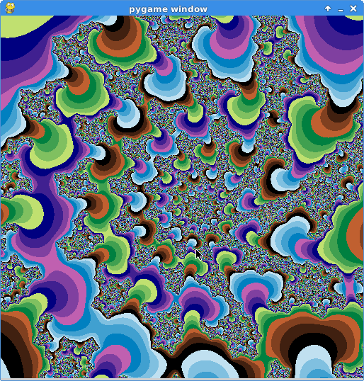
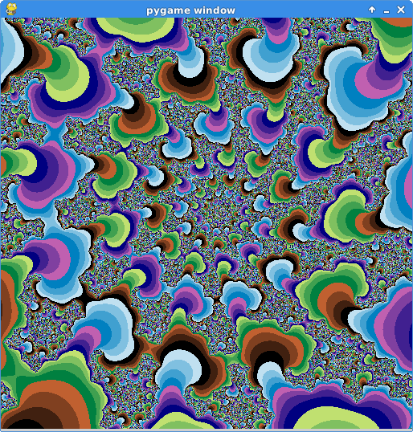
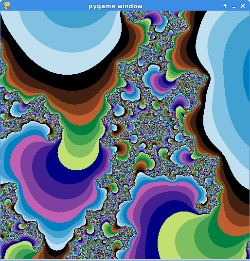
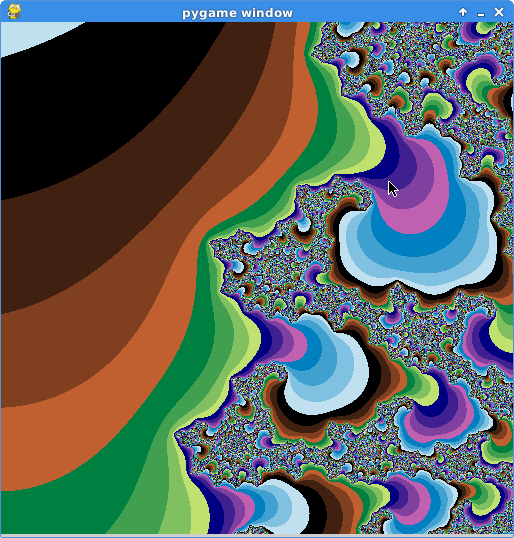
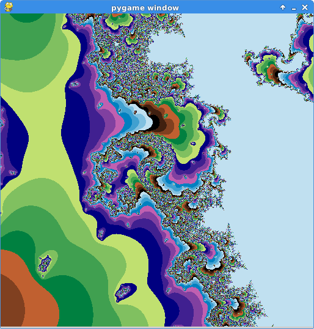
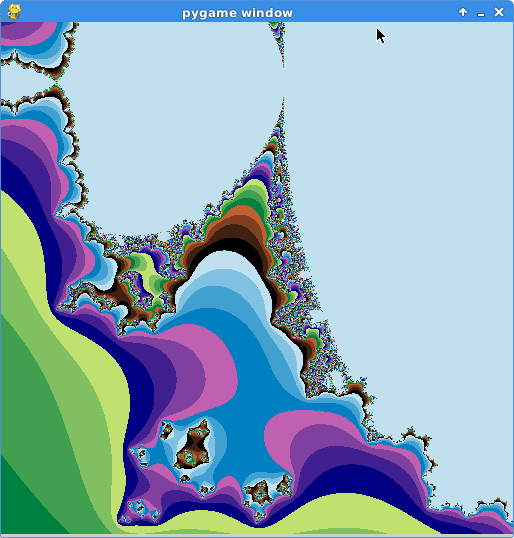
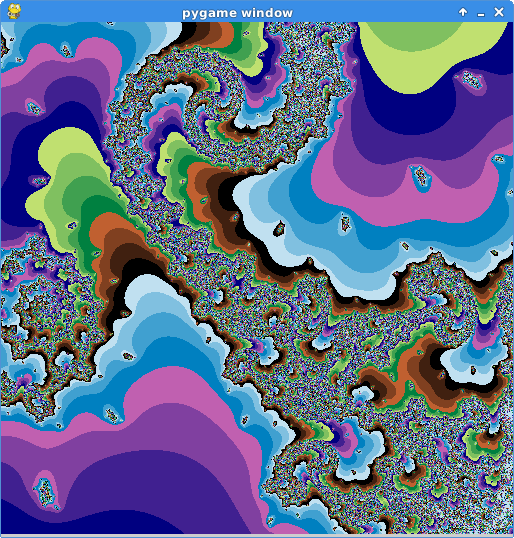
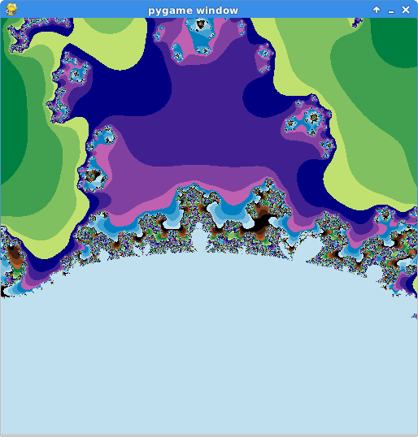
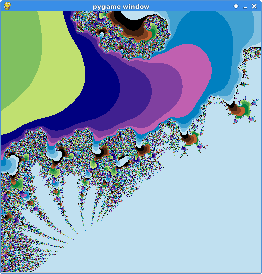
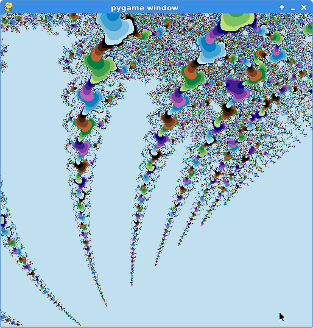
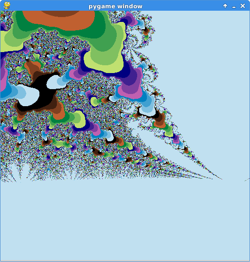
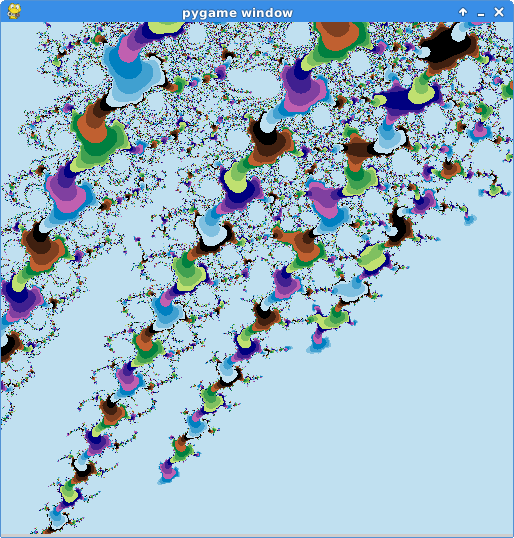
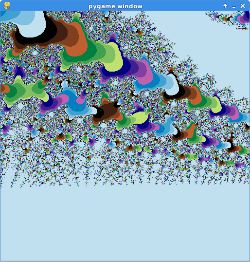
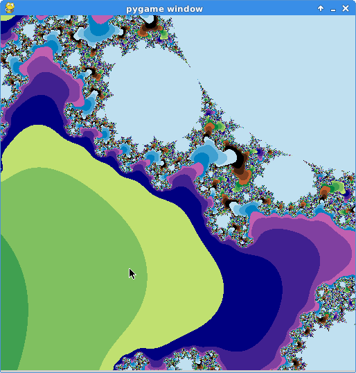
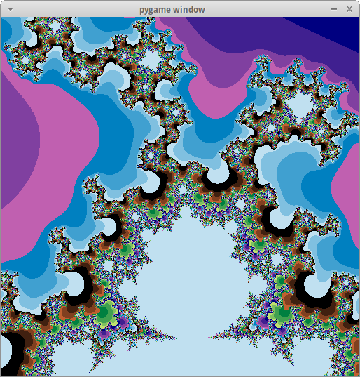
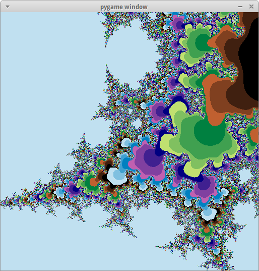
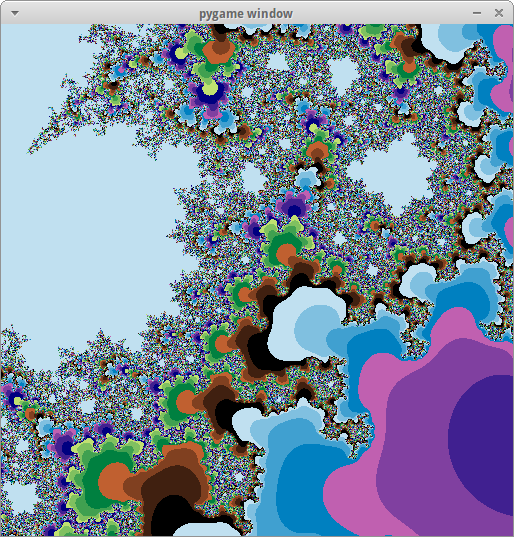
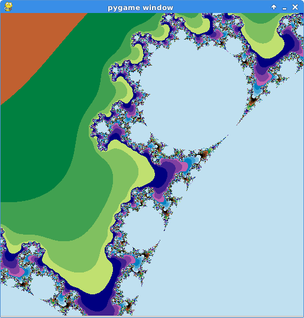

## Development

The code of Nextra is under the [`core`](https://github.com/shuding/nextra/tree/core) branch.

## Themes

- [nextra-theme-docs](https://github.com/vercel/swr-site) ([demo](https://swr.vercel.app))
- [nextra-theme-blog](https://github.com/shuding/site) ([demo](https://shud.in))

---

Created by [@shuding](https://github.com/shuding) and [@pacocoursey](https://github.com/pacocoursey) at [Vercel](https://vercel.com). Released under the MIT license.

