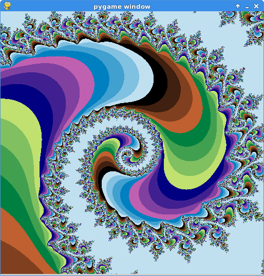
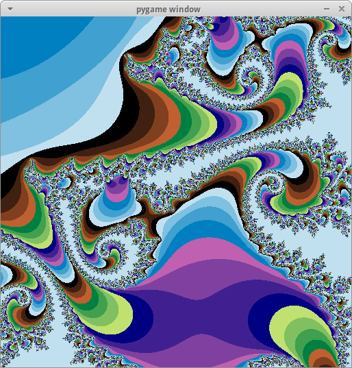
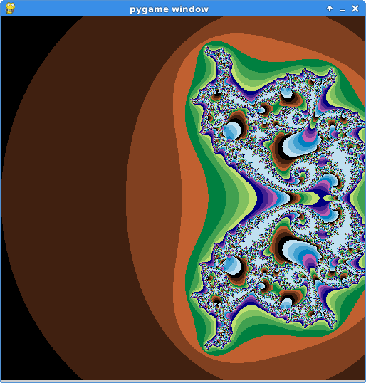

# Phoenix Set 

[https://www.ultrafractal.com/help/index.html?/help/formulas/standard/phoenix.html](https://www.ultrafractal.com/help/index.html?/help/formulas/standard/phoenix.html)

[Phoenix](phoenix.py)

